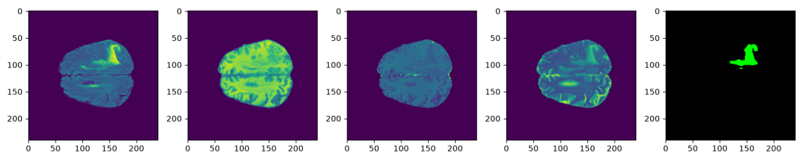
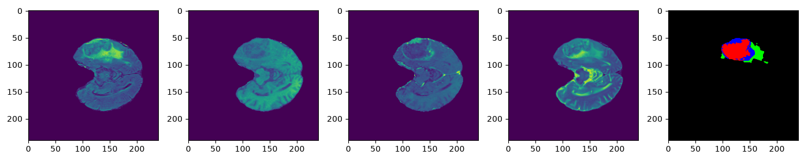

# Image-Segmentation
PyTorch U-net model for image segmentation

Deployed for brain tumour detection using the BraTS2020 dataset (available here: https://www.kaggle.com/datasets/awsaf49/brats2020-training-data/)

